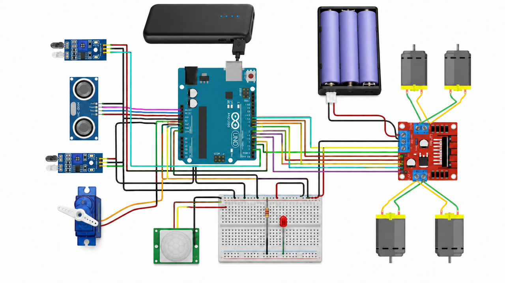

# Surveillance-UGV-Type-0
## Intro
An extremely cost effective autonomous surveillance UGV capable of patrolling, detecting motion, and following objects/threats in real-time — designed for surveillance and reconnaissance applications.

---

## Description
Surveillance-UGV-Type-0 is a robotics project that implements an autonomous Unmanned Ground Vehicle (UGV) with advanced obstacle avoidance and motion detection capabilities. The UGV autonomously patrols a designated area, detects motion using sensors, and can follow detected objects. It features intelligent navigation to avoid obstacles and maintain stable autonomous operation all while being extremely cost effective.

### Key Features:
- Autonomous patrolling and surveillance
- Real-time motion detection
- Object following capabilities
- Obstacle avoidance system
- Modular and upgradeable design

---

## Tech Stack
- **Arduino** (microcontroller programming)
- **C/C++** (Arduino language)
- **Motor Control Libraries** (DC motor driving)
- **Sensor Integration** (motion detection, obstacle sensing, distance calculation)
- **Embedded Systems** (autonomous vehicle logic)

---
##  Video Showcase (Click!)

---

## Circuit Diagram

The circuit diagram above shows the complete wiring and component layout for the Surveillance-UGV-Type-0, including motor connections, sensor integration, and power distribution.

---

## ⚠️ Known Issues
- Motion detection may trigger false positives in changing lighting conditions
- Object following speed inconsistencies depending on battery power.
- Limited battery life during continuous operation.

---

## Future Development
- Improved sensor fusion for better obstacle detection
- GPS integration for autonomous waypoint navigation
- Live video streaming capability
- Enhanced motion detection algorithm with ML-based filtering
- Mobile app for remote control and monitoring
- Multi-robot coordination for group patrols
- Power management optimization for extended operation time
- Custom PCB design for compact integration

---

### Fun Fact
The UGV was intentionally stripped out of its original suicidal logic of attempting to crash into the detected anomaly (with immaginary explosive filler of course) in order to comply with "academic" guidelines/polices. 
